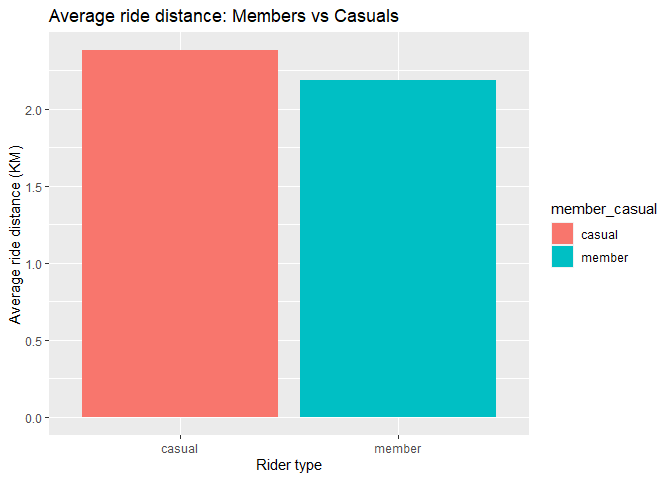
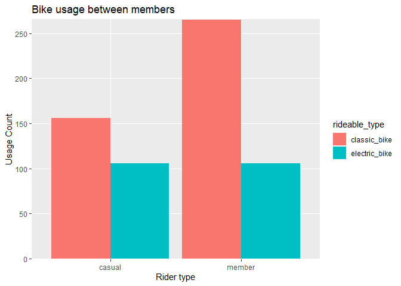

How Does a Bike-Share Navigate Speedy Success?
================

------------------------------------------------------------------------

## Before we start…

------------------------------------------------------------------------

Welcome to my first notebook (with R) in my portfolio. I will be
publishing two notebooks as part of the Coursera: Google Data Analytics
Certification Course. This will be the first notebook for the capstone
projects the course has assigned to learners. I aim to update these
notebooks as I slowly gain more knowledge with using R and apply new
skills / methods to perform further analysis on this case study.

------------------------------------------------------------------------

## Introduction

------------------------------------------------------------------------

Cyclistic (fictional company) is a bike-share program that features more
than 5,800 bicycles and 600 docking stations. Cyclistic sets itself
apart by also offering reclining bikes, hand tricycles, and cargo bikes,
making bike-share more inclusive to people with disabilities and riders
who can’t use a standard two-wheeled bike. The majority of riders opt
for traditional bikes; about 8% of riders use the assistive options.
Cyclistic users are more likely to ride for leisure, but about 30% use
them to commute to work each day.

Until now, Cyclistic’s marketing strategy relied on building general
awareness and appealing to broad consumer segments. One approach that
helped make these things possible was the flexibility of its pricing
plans: single-ride passes, full-day passes, and annual memberships.
Customers who purchase single-ride or full-day passes are referred to as
**casual riders**. Customers who purchase annual memberships are
**Cyclistic members**.

Cyclistic’s finance analysts have concluded that *annual members are
much more profitable than casual riders*. Although the pricing
flexibility helps Cyclistic attract more customers, **Lily Moreno, the
director of marketing**, believes that maximizing the number of annual
members will be key to future growth. Rather than creating a marketing
campaign that targets all-new customers, Moreno believes there is a very
good chance to convert casual riders into members. She notes that casual
riders are already aware of the Cyclistic program and have chosen
Cyclistic for their mobility needs.

Moreno has set a clear goal: **Design marketing strategies aimed at
converting casual riders into annual members**. In order to do that,
however, the marketing analyst team needs to better understand how
annual members and casual riders differ, why casual riders would buy a
membership, and how digital media could affect their marketing
tactics.Moreno and her team is interested in analyzing the Cyclistic
historical bike trip data to identify trends.

Three questions will guide the future marketing program:

1.  How do annual members and casual riders use Cyclistic bikes
    differently?
2.  Why would casual riders buy Cyclistic annual memberships?
3.  How can Cyclistic use digital media to influence casual riders to
    become members?

Moreno has assigned us the first question to answer: **How do annual
members and casual riders use Cyclistic bikes differently?**

------------------------------------------------------------------------

## Preparing and Processing data

------------------------------------------------------------------------

We will be using Cyclistic’s historical trip data to analyze and
identify trends. This includes the previous 12 months of Cyclistic’s
trip data.

``` r
library(tidyverse)
library(lubridate)
library(geosphere)
library(outliers)
```

``` r
data_files <- list.files(pattern = "*.csv")
df_list <- lapply(data_files, read_csv)
cyclistic_df <- bind_rows(df_list)
```

``` r
# Now, we will do an initial inspection of our data frame to get a glimpse of what our data frame holds.

str(cyclistic_df)
```

    ## spec_tbl_df [6,687,395 × 13] (S3: spec_tbl_df/tbl_df/tbl/data.frame)
    ##  $ ride_id           : chr [1:6687395] "99103BB87CC6C1BB" "EAFCCCFB0A3FC5A1" "9EF4F46C57AD234D" "5834D3208BFAF1DA" ...
    ##  $ rideable_type     : chr [1:6687395] "electric_bike" "electric_bike" "electric_bike" "electric_bike" ...
    ##  $ started_at        : POSIXct[1:6687395], format: "2021-08-10 17:15:49" "2021-08-10 17:23:14" ...
    ##  $ ended_at          : POSIXct[1:6687395], format: "2021-08-10 17:22:44" "2021-08-10 17:39:24" ...
    ##  $ start_station_name: chr [1:6687395] NA NA NA NA ...
    ##  $ start_station_id  : chr [1:6687395] NA NA NA NA ...
    ##  $ end_station_name  : chr [1:6687395] NA NA NA NA ...
    ##  $ end_station_id    : chr [1:6687395] NA NA NA NA ...
    ##  $ start_lat         : num [1:6687395] 41.8 41.8 42 42 41.8 ...
    ##  $ start_lng         : num [1:6687395] -87.7 -87.7 -87.7 -87.7 -87.6 ...
    ##  $ end_lat           : num [1:6687395] 41.8 41.8 42 42 41.8 ...
    ##  $ end_lng           : num [1:6687395] -87.7 -87.6 -87.7 -87.7 -87.6 ...
    ##  $ member_casual     : chr [1:6687395] "member" "member" "member" "member" ...
    ##  - attr(*, "spec")=
    ##   .. cols(
    ##   ..   ride_id = col_character(),
    ##   ..   rideable_type = col_character(),
    ##   ..   started_at = col_datetime(format = ""),
    ##   ..   ended_at = col_datetime(format = ""),
    ##   ..   start_station_name = col_character(),
    ##   ..   start_station_id = col_character(),
    ##   ..   end_station_name = col_character(),
    ##   ..   end_station_id = col_character(),
    ##   ..   start_lat = col_double(),
    ##   ..   start_lng = col_double(),
    ##   ..   end_lat = col_double(),
    ##   ..   end_lng = col_double(),
    ##   ..   member_casual = col_character()
    ##   .. )
    ##  - attr(*, "problems")=<externalptr>

``` r
head(cyclistic_df, 10)
```

    ## # A tibble: 10 × 13
    ##    ride_id       ridea…¹ started_at          ended_at            start…² start…³
    ##    <chr>         <chr>   <dttm>              <dttm>              <chr>   <chr>  
    ##  1 99103BB87CC6… electr… 2021-08-10 17:15:49 2021-08-10 17:22:44 <NA>    <NA>   
    ##  2 EAFCCCFB0A3F… electr… 2021-08-10 17:23:14 2021-08-10 17:39:24 <NA>    <NA>   
    ##  3 9EF4F46C57AD… electr… 2021-08-21 02:34:23 2021-08-21 02:50:36 <NA>    <NA>   
    ##  4 5834D3208BFA… electr… 2021-08-21 06:52:55 2021-08-21 07:08:13 <NA>    <NA>   
    ##  5 CD825CB87ED1… electr… 2021-08-19 11:55:29 2021-08-19 12:04:11 <NA>    <NA>   
    ##  6 612F12C94A96… electr… 2021-08-19 12:41:12 2021-08-19 12:47:47 <NA>    <NA>   
    ##  7 C7435946FDFF… electr… 2021-08-19 12:21:50 2021-08-19 12:37:31 <NA>    <NA>   
    ##  8 C67017767EED… electr… 2021-08-13 14:52:35 2021-08-13 14:58:16 <NA>    <NA>   
    ##  9 ABC4532F2B49… electr… 2021-08-17 18:23:55 2021-08-17 18:24:13 <NA>    <NA>   
    ## 10 82437E52DC3B… electr… 2021-08-04 12:50:53 2021-08-04 13:08:20 <NA>    <NA>   
    ## # … with 7 more variables: end_station_name <chr>, end_station_id <chr>,
    ## #   start_lat <dbl>, start_lng <dbl>, end_lat <dbl>, end_lng <dbl>,
    ## #   member_casual <chr>, and abbreviated variable names ¹​rideable_type,
    ## #   ²​start_station_name, ³​start_station_id

``` r
summary(cyclistic_df)
```

    ##    ride_id          rideable_type        started_at                    
    ##  Length:6687395     Length:6687395     Min.   :2021-08-01 00:00:04.00  
    ##  Class :character   Class :character   1st Qu.:2021-10-05 23:53:29.50  
    ##  Mode  :character   Mode  :character   Median :2022-04-05 13:03:11.00  
    ##                                        Mean   :2022-02-24 01:00:11.91  
    ##                                        3rd Qu.:2022-06-28 18:21:44.00  
    ##                                        Max.   :2022-08-31 23:59:39.00  
    ##                                                                        
    ##     ended_at                     start_station_name start_station_id  
    ##  Min.   :2021-08-01 00:03:11.0   Length:6687395     Length:6687395    
    ##  1st Qu.:2021-10-06 00:23:57.5   Class :character   Class :character  
    ##  Median :2022-04-05 13:15:03.0   Mode  :character   Mode  :character  
    ##  Mean   :2022-02-24 01:20:10.7                                        
    ##  3rd Qu.:2022-06-28 18:39:52.5                                        
    ##  Max.   :2022-09-06 21:49:04.0                                        
    ##                                                                       
    ##  end_station_name   end_station_id       start_lat       start_lng     
    ##  Length:6687395     Length:6687395     Min.   :41.64   Min.   :-87.84  
    ##  Class :character   Class :character   1st Qu.:41.88   1st Qu.:-87.66  
    ##  Mode  :character   Mode  :character   Median :41.90   Median :-87.64  
    ##                                        Mean   :41.90   Mean   :-87.65  
    ##                                        3rd Qu.:41.93   3rd Qu.:-87.63  
    ##                                        Max.   :45.64   Max.   :-73.80  
    ##                                                                        
    ##     end_lat         end_lng       member_casual     
    ##  Min.   :41.39   Min.   :-88.97   Length:6687395    
    ##  1st Qu.:41.88   1st Qu.:-87.66   Class :character  
    ##  Median :41.90   Median :-87.64   Mode  :character  
    ##  Mean   :41.90   Mean   :-87.65                     
    ##  3rd Qu.:41.93   3rd Qu.:-87.63                     
    ##  Max.   :42.37   Max.   :-87.50                     
    ##  NA's   :6433    NA's   :6433

``` r
# Let's check if there are any duplicate entries in our data frame.
sum(duplicated(cyclistic_df))
```

    ## [1] 0

``` r
#Now, let's check the type of bikes Cyclistic has in their service.
cyclistic_df %>%
  distinct(rideable_type)
```

    ## # A tibble: 3 × 1
    ##   rideable_type
    ##   <chr>        
    ## 1 electric_bike
    ## 2 classic_bike 
    ## 3 docked_bike

------------------------------------------------------------------------

Let’s check the individual columns for null values and drop these rows.
(After coming back to review this project, I realised I should instead
drop the rows with the end_lat and end_lng values null, whilst
preserving the rows with start_station_name and start_station_id values
as null.

------------------------------------------------------------------------

``` r
colSums(is.na(cyclistic_df))
```

    ##            ride_id      rideable_type         started_at           ended_at 
    ##                  0                  0                  0                  0 
    ## start_station_name   start_station_id   end_station_name     end_station_id 
    ##             972823             972821            1040418            1040418 
    ##          start_lat          start_lng            end_lat            end_lng 
    ##                  0                  0               6433               6433 
    ##      member_casual 
    ##                  0

``` r
cyclistic_df_new <- drop_na(cyclistic_df)
```

------------------------------------------------------------------------

Now, let’s create a new data frame with new variables to conduct our
analysis later on. We’ll create columns reflecting values for ride
length, day of ride, time of ride and ride distance.

------------------------------------------------------------------------

``` r
cyclistic_df_new <- mutate(cyclistic_df_new, ride_length_seconds = round(difftime(ended_at, started_at, units = "secs")))
cyclistic_df_new <- mutate(cyclistic_df_new, ride_length_mins = round(difftime(ended_at, started_at, units = "mins"), digits = 1))
cyclistic_df_new <- mutate(cyclistic_df_new, day_of_week = weekdays(as.Date(cyclistic_df_new$started_at)))
cyclistic_df_new <- mutate(cyclistic_df_new, start_time = format(started_at, format = "%H:%M:%S"))
cyclistic_df_new <- mutate(cyclistic_df_new, end_time = format(ended_at, format = "%H:%M:%S"))

cyclistic_df_new$ride_length_seconds <- as.numeric(cyclistic_df_new$ride_length_seconds)
cyclistic_df_new$ride_length_mins <- as.numeric(cyclistic_df_new$ride_length_mins)
```

------------------------------------------------------------------------

Calculating distance using a function from the geosphere library. The
formulas in this library does not differ too much in calculations
output. Hence, I decided to use the distHaversine function that uses the
Haversine formula to find the distance between two points on a sphere.

------------------------------------------------------------------------

``` r
cyclistic_df_new$ride_distance <- distHaversine(matrix(c(cyclistic_df_new$start_lng, cyclistic_df_new$start_lat), 
                                                       ncol = 2), 
                                                matrix(c(cyclistic_df_new$end_lng, cyclistic_df_new$end_lat), 
                                                       ncol = 2))

# The default units for the fns() in geosphere is meters by default. I'm going to change this to km (dividing by 1000)
cyclistic_df_new$ride_distance <- cyclistic_df_new$ride_distance / 1000
```

``` r
#Let's take a look at our new data frame.
head(cyclistic_df_new, 10)
```

    ## # A tibble: 10 × 19
    ##    ride_id       ridea…¹ started_at          ended_at            start…² start…³
    ##    <chr>         <chr>   <dttm>              <dttm>              <chr>   <chr>  
    ##  1 DD06751C6019… classi… 2021-08-08 17:21:26 2021-08-08 17:25:37 Despla… TA1306…
    ##  2 79973DC3B232… classi… 2021-08-27 08:53:52 2021-08-27 09:18:29 Larrab… TA1309…
    ##  3 0249AD4B2588… classi… 2021-08-08 12:59:18 2021-08-08 12:59:55 Aberde… 13157  
    ##  4 F41EB054E44A… classi… 2021-08-12 16:52:09 2021-08-12 16:56:51 Michig… 13042  
    ##  5 B149E6C71A1C… classi… 2021-08-23 15:33:04 2021-08-23 16:09:00 Michig… 13042  
    ##  6 C41829CD6CC5… classi… 2021-08-23 10:11:09 2021-08-23 10:51:11 Aberde… 13157  
    ##  7 C3C88F6EE534… electr… 2021-08-28 23:09:44 2021-08-28 23:11:09 Larrab… TA1309…
    ##  8 987AF38D6208… classi… 2021-08-20 22:38:08 2021-08-20 23:32:13 Wells … TA1306…
    ##  9 08B43209BB07… electr… 2021-08-09 18:32:40 2021-08-09 19:31:38 Michig… 13042  
    ## 10 6882EBAFAABD… classi… 2021-08-05 13:22:07 2021-08-05 13:42:44 Kingsb… KA1503…
    ## # … with 13 more variables: end_station_name <chr>, end_station_id <chr>,
    ## #   start_lat <dbl>, start_lng <dbl>, end_lat <dbl>, end_lng <dbl>,
    ## #   member_casual <chr>, ride_length_seconds <dbl>, ride_length_mins <dbl>,
    ## #   day_of_week <chr>, start_time <chr>, end_time <chr>, ride_distance <dbl>,
    ## #   and abbreviated variable names ¹​rideable_type, ²​start_station_name,
    ## #   ³​start_station_id

``` r
summary(cyclistic_df_new)
```

    ##    ride_id          rideable_type        started_at                    
    ##  Length:5234555     Length:5234555     Min.   :2021-08-01 00:00:04.00  
    ##  Class :character   Class :character   1st Qu.:2021-10-01 17:11:16.00  
    ##  Mode  :character   Mode  :character   Median :2022-04-05 06:12:22.00  
    ##                                        Mean   :2022-02-22 12:08:37.67  
    ##                                        3rd Qu.:2022-06-28 09:16:24.00  
    ##                                        Max.   :2022-08-31 23:58:50.00  
    ##     ended_at                      start_station_name start_station_id  
    ##  Min.   :2021-08-01 00:03:30.00   Length:5234555     Length:5234555    
    ##  1st Qu.:2021-10-01 17:29:20.50   Class :character   Class :character  
    ##  Median :2022-04-05 06:22:08.00   Mode  :character   Mode  :character  
    ##  Mean   :2022-02-22 12:27:01.99                                        
    ##  3rd Qu.:2022-06-28 09:30:40.50                                        
    ##  Max.   :2022-09-01 19:10:49.00                                        
    ##  end_station_name   end_station_id       start_lat       start_lng     
    ##  Length:5234555     Length:5234555     Min.   :41.65   Min.   :-87.83  
    ##  Class :character   Class :character   1st Qu.:41.88   1st Qu.:-87.66  
    ##  Mode  :character   Mode  :character   Median :41.90   Median :-87.64  
    ##                                        Mean   :41.90   Mean   :-87.64  
    ##                                        3rd Qu.:41.93   3rd Qu.:-87.63  
    ##                                        Max.   :45.64   Max.   :-73.80  
    ##     end_lat         end_lng       member_casual      ride_length_seconds
    ##  Min.   :41.65   Min.   :-87.83   Length:5234555     Min.   :  -7745    
    ##  1st Qu.:41.88   1st Qu.:-87.66   Class :character   1st Qu.:    385    
    ##  Median :41.90   Median :-87.64   Mode  :character   Median :    673    
    ##  Mean   :41.90   Mean   :-87.64                      Mean   :   1104    
    ##  3rd Qu.:41.93   3rd Qu.:-87.63                      3rd Qu.:   1209    
    ##  Max.   :42.17   Max.   :-87.53                      Max.   :2497750    
    ##  ride_length_mins   day_of_week         start_time          end_time        
    ##  Min.   : -129.10   Length:5234555     Length:5234555     Length:5234555    
    ##  1st Qu.:    6.40   Class :character   Class :character   Class :character  
    ##  Median :   11.20   Mode  :character   Mode  :character   Mode  :character  
    ##  Mean   :   18.41                                                           
    ##  3rd Qu.:   20.10                                                           
    ##  Max.   :41629.20                                                           
    ##  ride_distance      
    ##  Min.   :   0.0000  
    ##  1st Qu.:   0.8974  
    ##  Median :   1.6009  
    ##  Mean   :   2.1192  
    ##  3rd Qu.:   2.7858  
    ##  Max.   :1190.8545

``` r
str(cyclistic_df_new)
```

    ## tibble [5,234,555 × 19] (S3: tbl_df/tbl/data.frame)
    ##  $ ride_id            : chr [1:5234555] "DD06751C6019D865" "79973DC3B232048F" "0249AD4B258806AD" "F41EB054E44ACFDA" ...
    ##  $ rideable_type      : chr [1:5234555] "classic_bike" "classic_bike" "classic_bike" "classic_bike" ...
    ##  $ started_at         : POSIXct[1:5234555], format: "2021-08-08 17:21:26" "2021-08-27 08:53:52" ...
    ##  $ ended_at           : POSIXct[1:5234555], format: "2021-08-08 17:25:37" "2021-08-27 09:18:29" ...
    ##  $ start_station_name : chr [1:5234555] "Desplaines St & Kinzie St" "Larrabee St & Armitage Ave" "Aberdeen St & Jackson Blvd" "Michigan Ave & Oak St" ...
    ##  $ start_station_id   : chr [1:5234555] "TA1306000003" "TA1309000006" "13157" "13042" ...
    ##  $ end_station_name   : chr [1:5234555] "Kingsbury St & Kinzie St" "Michigan Ave & Oak St" "Aberdeen St & Jackson Blvd" "Michigan Ave & Oak St" ...
    ##  $ end_station_id     : chr [1:5234555] "KA1503000043" "13042" "13157" "13042" ...
    ##  $ start_lat          : num [1:5234555] 41.9 41.9 41.9 41.9 41.9 ...
    ##  $ start_lng          : num [1:5234555] -87.6 -87.6 -87.7 -87.6 -87.6 ...
    ##  $ end_lat            : num [1:5234555] 41.9 41.9 41.9 41.9 41.9 ...
    ##  $ end_lng            : num [1:5234555] -87.6 -87.6 -87.7 -87.6 -87.6 ...
    ##  $ member_casual      : chr [1:5234555] "member" "member" "member" "casual" ...
    ##  $ ride_length_seconds: num [1:5234555] 251 1477 37 282 2156 ...
    ##  $ ride_length_mins   : num [1:5234555] 4.2 24.6 0.6 4.7 35.9 40 1.4 54.1 59 20.6 ...
    ##  $ day_of_week        : chr [1:5234555] "Sunday" "Friday" "Sunday" "Thursday" ...
    ##  $ start_time         : chr [1:5234555] "17:21:26" "08:53:52" "12:59:18" "16:52:09" ...
    ##  $ end_time           : chr [1:5234555] "17:25:37" "09:18:29" "12:59:55" "16:56:51" ...
    ##  $ ride_distance      : num [1:5234555] 0.495 2.524 0 0 0 ...

------------------------------------------------------------------------

I noticed that the minimum ride length is below 0 (-7745) and the
minimum ride distance is 0. Both values are impossible / does not make
sense and we’ll be dropping those rows. Stated in the guide script
provided to us is that, “*the data frame includes a few hundred entries
when bikes were taken out of docks and checked for quality by Divvy*”,
which could explain why some values were as such (below 0).

------------------------------------------------------------------------

``` r
cyclistic_df_new <- cyclistic_df_new %>%
  filter(ride_distance > 0 & ride_length_seconds > 0)
```

------------------------------------------------------------------------

Sampling data set with sample size of 666 based on 99% confidence, 5%
margin of error and 6.7 million population size. The sample size was
calculated by an online sample size calculator.

------------------------------------------------------------------------

``` r
sampled_cyclistic <- sample_n(cyclistic_df_new, size = 666, replace = FALSE)
summary(sampled_cyclistic)
```

    ##    ride_id          rideable_type        started_at                    
    ##  Length:666         Length:666         Min.   :2021-08-01 15:55:49.00  
    ##  Class :character   Class :character   1st Qu.:2021-09-25 13:55:33.75  
    ##  Mode  :character   Mode  :character   Median :2022-03-20 17:46:20.00  
    ##                                        Mean   :2022-02-17 03:41:20.71  
    ##                                        3rd Qu.:2022-06-29 09:10:20.75  
    ##                                        Max.   :2022-08-31 22:43:02.00  
    ##     ended_at                      start_station_name start_station_id  
    ##  Min.   :2021-08-01 16:00:41.00   Length:666         Length:666        
    ##  1st Qu.:2021-09-25 14:04:53.75   Class :character   Class :character  
    ##  Median :2022-03-20 17:57:32.00   Mode  :character   Mode  :character  
    ##  Mean   :2022-02-17 03:58:43.50                                        
    ##  3rd Qu.:2022-06-29 09:21:14.25                                        
    ##  Max.   :2022-08-31 22:45:56.00                                        
    ##  end_station_name   end_station_id       start_lat       start_lng     
    ##  Length:666         Length:666         Min.   :41.75   Min.   :-87.81  
    ##  Class :character   Class :character   1st Qu.:41.88   1st Qu.:-87.66  
    ##  Mode  :character   Mode  :character   Median :41.90   Median :-87.64  
    ##                                        Mean   :41.90   Mean   :-87.64  
    ##                                        3rd Qu.:41.93   3rd Qu.:-87.63  
    ##                                        Max.   :42.06   Max.   :-87.56  
    ##     end_lat         end_lng       member_casual      ride_length_seconds
    ##  Min.   :41.75   Min.   :-87.77   Length:666         Min.   :   13.0    
    ##  1st Qu.:41.88   1st Qu.:-87.66   Class :character   1st Qu.:  406.5    
    ##  Median :41.90   Median :-87.64   Mode  :character   Median :  686.5    
    ##  Mean   :41.90   Mean   :-87.64                      Mean   : 1042.8    
    ##  3rd Qu.:41.93   3rd Qu.:-87.63                      3rd Qu.: 1229.8    
    ##  Max.   :42.06   Max.   :-87.57                      Max.   :18650.0    
    ##  ride_length_mins day_of_week         start_time          end_time        
    ##  Min.   :  0.20   Length:666         Length:666         Length:666        
    ##  1st Qu.:  6.80   Class :character   Class :character   Class :character  
    ##  Median : 11.40   Mode  :character   Mode  :character   Mode  :character  
    ##  Mean   : 17.38                                                           
    ##  3rd Qu.: 20.48                                                           
    ##  Max.   :310.80                                                           
    ##  ride_distance      
    ##  Min.   : 0.000416  
    ##  1st Qu.: 1.012843  
    ##  Median : 1.749463  
    ##  Mean   : 2.269546  
    ##  3rd Qu.: 2.832399  
    ##  Max.   :10.869879

------------------------------------------------------------------------

## Analysis

------------------------------------------------------------------------

### Average ride time grouped by rider types

``` r
avg_ride_time_member_secs <- sampled_cyclistic %>%
  group_by(member_casual) %>%
  summarise(mean_ride_time = mean(ride_length_seconds))

avg_ride_time_viz <- ggplot(avg_ride_time_member_secs, aes(x=member_casual, y=mean_ride_time, fill=member_casual)) +
  geom_col() +
  labs(title="Average ride time: Members vs Casuals", x="Rider type", y="Ride time (seconds)")

avg_ride_time_viz
```

<!-- --> \*\*\*

### Average distance travelled, grouped by rider types

``` r
avg_ride_dist_member <- sampled_cyclistic %>%
  group_by(member_casual) %>%
  summarise(mean_distance = mean(ride_distance))

avg_ride_dist_viz <- ggplot(avg_ride_dist_member, aes(x=member_casual, y=mean_distance, fill=member_casual)) +
  geom_col() +
  labs(title="Average ride distance: Members vs Casuals", x="Rider type", y="Average ride distance (KM)")

avg_ride_dist_viz
```

<!-- --> \*\*\*

These two visualizations tells us both rider types ride their bikes more
or less the same distances, but casual riders are spending longer times
on their journeys than members. This suggests that casual riders, well,
take their rides *casually* while members are riding their bikes in a
hurry (probably rushing off to work?).

------------------------------------------------------------------------

### Ride count in a week, grouped by rider type

``` r
daily_rides_member <- sampled_cyclistic %>%
  mutate(day_of_week = wday(started_at, label = TRUE)) %>%
  group_by(member_casual, day_of_week) %>%
  summarise(daily_count = n())

daily_rides_member_viz <- ggplot(daily_rides_member, aes(x=day_of_week, y=daily_count, fill=member_casual)) +
  geom_col(position = "dodge") +
  labs(title="Ride count in a week, by rider type", x="Days", y="Ride count")

daily_rides_member_viz
```

<!-- --> \*\*\*

It gets even more interesting here. We can see that on the weekdays,
members use the bikes more than the casual riders. However, on the
weekends, it’s the casual riders that use the bikes more than the
members. Could this be because during the weekdays, members are using
these bikes more to reach work (kind of creating a “peak hour bike
rush”) and leaving lesser bikes for the casual riders to use?

Or could it be because of the subscription type of payment scheme,

*(remember earlier in the introduction, “Customers who purchase
single-ride or full-day passes are referred to as **casual riders**.
Customers who purchase annual memberships are **Cyclistic members**)*,

where it would be cheaper overall to get annual memberships rather than
paying on a per ride basis? Due to this, casual riders may not be
interested to use these bikes and resort to other modes of commute.

------------------------------------------------------------------------

### Bike usage comparison between rider types.

``` r
total_bike_usage <- sampled_cyclistic %>%
  filter(rideable_type != "docked_bike") %>%
  group_by(member_casual, rideable_type) %>%
  summarise(sum_bike_usage = n())

total_bike_usage_viz <- ggplot(total_bike_usage, aes(x=member_casual, y=sum_bike_usage, fill=rideable_type)) +
  geom_col(position = "dodge") +
  scale_y_discrete(limits = c(0, 50, 100, 150, 200, 250)) +
  labs(title="Bike usage between members", x="Rider type", y="Usage Count")

total_bike_usage_viz
```

<!-- --> \*\*\*

### Average ride time between bikes (grouped by members)

``` r
avg_bike_duration <- sampled_cyclistic %>%
  filter(rideable_type != "docked_bike") %>%
  group_by(member_casual, rideable_type) %>%
  summarise(avg_bike_usage = mean(ride_length_seconds))

avg_bike_usage_viz <- ggplot(avg_bike_duration, aes(x=member_casual, y=avg_bike_usage, fill=rideable_type)) +
  geom_col(position = "dodge") +
  labs(title="Average ride duration by bikes", x="Rider type", y="Ride time (secs)")

avg_bike_usage_viz
```

<!-- --> \*\*\*

### Bike usage throughout the week (grouped by member type)

``` r
bike_usage_thru_week <- sampled_cyclistic %>%
  mutate(day_of_week = wday(started_at, label = TRUE)) %>%
  filter(rideable_type != "docked_bike") %>%
  group_by(member_casual, rideable_type, day_of_week) %>%
  summarise(daily_total = n())

avg_bike_usage_week_viz <- ggplot(bike_usage_thru_week, aes(x=day_of_week, y=daily_total, fill=rideable_type)) +
  geom_col(position = "dodge") +
  facet_grid(~member_casual) +
  labs(title="Average bike usage in a week", x="Days", y="Total usage count")
avg_bike_usage_week_viz
```

<!-- --> \*\*\*

From these three visualisations, we can deduce that the classic bikes
are favoured by both the casual and member riders over the electric
bikes. This could point to a specific scenario:

A rider (regardless of membership type) decides to commute to work on an
electric bike. The rider wants to take it easy and let the battery
powered motor do all the work for him, since it’s an electric bike.
However, the battery runs out of charge mid-trip and the rider has to
resort to pedalling manually, and it’s a workout for sure because of the
extra weight with the battery on the bike. After that experience, the
rider decides to use the classic bikes from then on.

This kind of experiences might have lead to riders wanting to use the
more “reliable” classic bike as there is one less contributing factor to
your trip being ruined.

------------------------------------------------------------------------

## Conclusion

------------------------------------------------------------------------

From these insights, we not only have information on how do annual
members and casual riders differ in the usage of Cyclistic bikes. We
could also make improvements on their experience using the bikes.

We could look into the pricing plans and make changes to attract the
casual riders to purchase an annual membership plan instead of sticking
with the pay per ride/day basis.

We could also improve our maintenance of the electric bikes to ensure
that they are adequately charged for repeated usage. A good place to
start is to increase the frequency we bring in electric bikes for
charging.

------------------------------------------------------------------------

## Reflection

------------------------------------------------------------------------

After completing this project, I realised several things:

-   I could have cleaned the data better / ensured more accurate data by
    dealing with rows with null values better. In hindsight, there were
    rows that should not have been dropped (rows with empty longitude /
    latitude values).

-   I was actually stuck at one point of this project as I wanted to
    analyse the spread of the values for ride distance and ride
    durations. However, upon doing so, the results were not normally
    distributed:

------------------------------------------------------------------------

``` r
ride_length_spread <- ggplot(sampled_cyclistic, aes(x=ride_length_seconds)) +
  geom_histogram() +
  labs(title="Ride length spread")

ride_length_spread
```

<!-- -->

``` r
# mean (ride length in seconds)
mean(sampled_cyclistic$ride_length_seconds)
```

    ## [1] 1042.799

``` r
# mean (ride distance in km)
mean(sampled_cyclistic$ride_distance)
```

    ## [1] 2.269546

``` r
# median (ride length in seconds)
median(sampled_cyclistic$ride_length_seconds)
```

    ## [1] 686.5

``` r
# median (ride distance in km)
median(sampled_cyclistic$ride_distance)
```

    ## [1] 1.749463

``` r
outlier(sampled_cyclistic$ride_length_seconds)
```

    ## [1] 18650

------------------------------------------------------------------------

The distribution was heavily right-skewed because the median was much
lower than the mean. I then applied log transformation to fix the
distribution…

------------------------------------------------------------------------

``` r
ride_length_spread <- ggplot(sampled_cyclistic, aes(x=log(ride_length_seconds))) +
  geom_histogram() +
  labs(title="Ride length spread")

ride_length_spread
```

<!-- --> \*\*\*

… and the distribution looks better than the previous one. However, I
was not sure what to do with this step. I intended to to a
one-sample-t-test to check if the sample mean was representative of the
population but I got stuck here (was I actually supposed to use this
distribution for the one-sample-t-test?)

-   I will update this case study with a dashboard with Tableau,
    featuring a viz of popular routes by rider types!

-   I will definitely be adding on to this case study every now and then
    as I learn more about statistics!

------------------------------------------------------------------------

------------------------------------------------------------------------

## Thank you!

------------------------------------------------------------------------

This concludes case study 1 of the Google Data Analytics Capstone
Project.

------------------------------------------------------------------------
